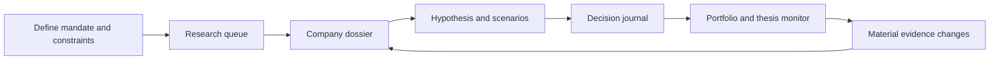
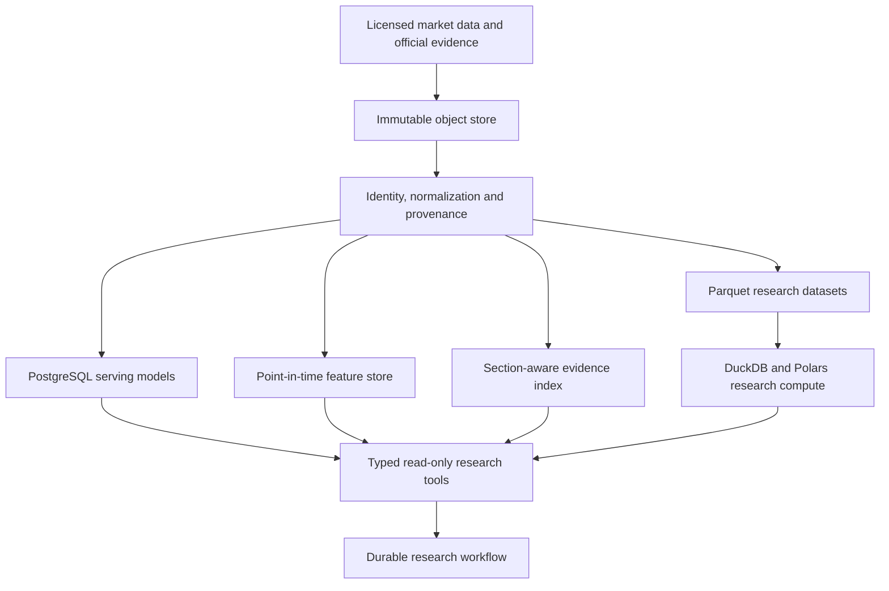

# Bulls Atlas Research OS

Status: approved architecture; private V1 vertical slice implemented July 2026. This document
defines a separate authenticated research product. It does not extend the public retail portal and
it does not authorize commercial use of unlicensed market data.

The implemented foundation includes tenant-bound organizations and workspaces, least-privilege
authorization policy, point-in-time research runs and steps, shared official evidence within one
tenant/market boundary, claim-to-source-span lineage, and composite database constraints that reject
cross-tenant and cross-market references. The current API exposes authenticated workspace
bootstrap/listing, a deterministic research-attention queue, and an evidence-first company dossier
backed by current analytics and market-specific official evidence adapters. PostgreSQL row-level
security, transaction-scoped tenant/market/user identity, and append-only audit events are active on
research tables.

Private V1 intentionally supports one self-provisioned organization/workspace per account. It does
not yet expose team invitations, member administration, SSO/SCIM, private document upload, billing,
exports, or the remaining four research workspaces described below. Those are product capabilities,
not implied by the existence of the underlying tenancy schema.

## Product thesis

Bulls Atlas is an evidence-first investment research workspace for DSE equities and US
small/micro-cap equities. It converts a user's mandate into a research queue, produces an auditable
company dossier, tests hypotheses against point-in-time data, records the investment thesis, and
monitors evidence that strengthens or invalidates it.

It is not:

- a chatbot wrapped around ticker pages;
- an autonomous trading system;
- a price-prediction model;
- a collection of persona agents voting on a stock;
- a replacement for licensed execution, quotes, or market-depth infrastructure.

The defensible wedge is the integrated workflow: DSE evidence plus US small-cap regulatory and
catalyst intelligence, reproducible research, and a persistent thesis that is continuously tested.

## User workflow

The visible application is organized around six workspaces:

1. **Research Queue**: a bounded, ranked list of names that deserve analyst time, with explicit
   reasons, evidence freshness, implementation liquidity, and disqualifying risks.
2. **Company Dossier**: business, financial trajectory, valuation, catalysts, filings, ownership,
   price structure, liquidity, forensic risks, bull/base/bear scenarios, and cited counter-evidence.
3. **Catalyst Calendar**: confirmed dates, inferred windows, source confidence, affected tickers,
   expected evidence, and post-event review.
4. **Hypothesis Lab**: natural-language research intent compiled into a constrained factor/event DSL,
   then tested with point-in-time data, transaction costs, walk-forward splits, and trial accounting.
5. **Portfolio Intelligence**: exposure, concentration, liquidity, factor/cap/sector decomposition,
   catalyst clustering, scenario stress, and thesis health.
6. **Research Memory**: versioned theses, assumptions, source snapshots, decisions, outcomes, and
   analyst calibration. It answers what changed, not merely what is true today.

Chat is a command surface inside these workflows, not the product's home page.

## Research queue

Market capitalization is a mandate/filter, not an investment verdict. Queue construction evaluates
separate dimensions and never hides them behind one unexplained score:

- eligibility, identity, data quality, and marketability;
- fundamental inflection and quality;
- valuation and market-implied expectations;
- confirmed or inferred catalysts;
- price structure and relative strength without rewarding already-extended moves;
- disclosed ownership, insider, beneficial-owner, and short-interest evidence;
- dilution, financing, governance, accounting, and listing risk;
- liquidity, capacity, volatility, and execution cost;
- novelty: what changed since the previous evidence snapshot;
- portfolio relevance and exposure overlap.

The ranking is a research-priority function, not a return forecast. Each candidate exposes the
dimensions, source dates, confidence, and exclusion reasons.

## Data architecture

### Storage responsibilities

- **PostgreSQL** remains the operational source of exact normalized facts, identities, current
  projections, research runs, claims, theses, permissions, and audit records.
- **pgvector** remains appropriate for semantic evidence retrieval. It is not used to forecast
  prices or replace exact SQL.
- **Object storage** retains licensed/allowed source documents and immutable snapshots by content
  hash. Large filing bodies and research artifacts do not belong in PostgreSQL rows.
- **Parquet plus DuckDB/Polars** serves reproducible cross-sectional research and backtests. This
  avoids turning the API database into an analytical warehouse.
- **Redis/arq** continues to deliver bounded asynchronous work. PostgreSQL is the durable run and
  step ledger. Introduce a heavier workflow platform only when measured concurrency or service
  topology makes the current durable-ledger pattern inadequate.

### Point-in-time contract

Every researchable observation requires:

- `effective_at`: the period or event the fact describes;
- `known_at`: the first instant the user could have known it;
- `ingested_at`: when the platform received it;
- `revision`: the as-filed or corrected version;
- `source_id`, source URL, document hash, unit, currency, and normalization rule.

Backtests and historical dossiers query `known_at <= decision_time`. Current DSE annual financial
and shareholding projections cannot be used safely in historical tests until their publication
times are reconstructed. Historical universes must include inactive and delisted securities.

## Evidence retrieval

The current vector-only, fixed-character retrieval is upgraded to a measured pipeline:

1. Parse documents by filing section, table, page, heading, issuer, form, period, and source span.
2. Route the question by intent and required tools.
3. Retrieve exact identifiers/phrases and metadata-filtered semantic candidates in parallel.
4. Fuse lexical and dense ranks with reciprocal-rank fusion.
5. Rerank a bounded candidate set with a multilingual cross-encoder.
6. Retrieve adjacent sections and required comparative periods.
7. Build an evidence pack before generation.
8. Verify every material claim, number, unit, period, and citation against the evidence pack.

The production English-only embedding model must not be assumed adequate for Bangla-to-English
retrieval. Benchmark Qwen3-Embedding and BGE-M3 (or later candidates) on a Bulls-owned bilingual
evaluation set before migration. Embedding dimensions and model versions become registry data,
not a single global compile-time constant.

## AI architecture

The system uses a typed research workflow, not an unconstrained swarm:

```mermaid
flowchart LR
  Request["Research request"] --> Planner["Plan with typed tasks"]
  Planner --> Collect["SQL, document, event and market tools"]
  Collect --> Evidence["Evidence and calculation ledger"]
  Evidence --> Analyst["Synthesis and scenarios"]
  Analyst --> Skeptic["Counter-thesis and missing evidence"]
  Skeptic --> Verify["Claim, number and citation verifier"]
  Verify --> Report["Versioned research artifact"]
```

- The planner may choose only registered, read-only tools and bounded task schemas.
- Deterministic code performs arithmetic, ratios, returns, valuation, screening, portfolio risk,
  and backtests. The language model explains results but does not calculate authoritative numbers.
- The skeptic must attempt to disprove the thesis and surface missing or contradictory evidence.
- The verifier can reject or downgrade unsupported claims. Abstention is a successful result.
- A research run stores model, prompt, tool, source, calculation, and code versions so the artifact
  is reproducible.
- Uploaded documents are untrusted data, never instructions. Prompt injection cannot grant tools,
  cross workspace boundaries, or alter system policy.

### Model strategy

- Use small local/open models for extraction, tagging, routing, and low-risk summaries only after
  task-specific evaluation.
- Use a strong open-weight reasoning model behind an OpenAI-compatible internal gateway for deep
  research. vLLM is the preferred GPU serving option when self-hosting is economically justified.
- The current CPU server should not host a serious 30B-class research model. Initially run deep
  research on a queued, metered GPU/API backend and cache artifacts by evidence fingerprint.
- Keep the model provider replaceable. Model promotion is based on Bulls finance evals, not public
  chat leaderboards.
- No forecasting ML is promoted until the point-in-time feature store, sufficient history,
  economic baselines, and walk-forward evaluation exist.

## High-value intelligence modules

### Evidence differential

Compare the newest filing/disclosure with prior periods and identify changed language, changed
numbers, removed risks, new risks, guidance changes, capital structure changes, and contradictions.

### Catalyst intelligence

Store catalysts as typed events with confirmed date/inferred window, source, confidence, affected
assumptions, expected evidence, and post-event outcome. Sector adapters add ClinicalTrials.gov/FDA
events for biotechnology and USAspending/SAM award changes for government contractors.

### Capital-structure and forensic monitor

For US small caps, parse shelf/ATM offerings, prospectus supplements, warrants, convertibles,
reverse splits, cash runway, going-concern language, auditor changes, restatements, material
weaknesses, insider Forms 3/4/5, Schedules 13D/G, Form 144, fails-to-deliver, true short interest,
and Reg SHO status. Daily FINRA short volume remains a distinct activity measure and is never
presented as short interest.

For DSE, prioritize disclosure changes, sponsor/director and institutional ownership history,
earnings/dividends, record dates, board meetings, category/operational status, block trades,
financial-submission status, going-concern evidence, and source-linked corporate actions.

### Hypothesis Lab

Natural language compiles to a versioned, reviewable DSL rather than arbitrary generated Python.
Runs must include:

- point-in-time universe and features;
- corporate-action-adjusted prices and delisted securities;
- realistic liquidity, transaction-cost, and position-size constraints;
- temporal train/validation/test separation and walk-forward results;
- benchmark and simple-factor baselines;
- trial count, parameter sensitivity, regime breakdown, and multiple-testing adjustment;
- reproducible code/data fingerprints and forward-monitoring status.

### Thesis monitor

Each accepted thesis records assumptions, catalysts, valuation/scenario inputs, invalidation rules,
review date, evidence snapshot, and owner. New data is compared with those assertions. Notifications
are emitted for material thesis changes, not every price movement or document publication.

## Separate product and tenancy

`apps/research` is a desktop-first application with a dense but restrained UI. It uses shared API
and domain packages, but does not couple its navigation or state to `apps/web`. One codebase is built
as two independent products: `research.bullsofdhaka.com` is fixed to DSE and
`research.bullsofwallst.com` is fixed to US equities. There is no market switch in the authenticated
application, and a build fails when tenant, market, site, or API configuration contradicts its
deployment profile.

`atlas.bullsofdhaka.com` and `atlas.bullsofwallst.com` are branded aliases of their respective
canonical research hostnames. Each alias is attached only to its tenant's CloudFront distribution,
certificate, Route 53 zone, CORS allowlist, and runtime host allowlist; aliases never redirect or
resolve across markets.

The existing `tenant_id` represents a branded market tenant and is insufficient by itself for
institutional customers. Research therefore has explicit isolation dimensions:

- market/brand tenant: DSE or US capabilities, locale, source entitlements;
- customer organization: private users, portfolios, notes, documents, research, and billing;
- workspace: team-specific universes, models, portfolios, and permissions.

Organization administration uses `owner`, `admin`, and `member` roles. Workspace research duties use
`portfolio_manager`, `analyst`, `risk`, and `viewer` roles. This separates customer administration
from investment responsibilities and avoids one overloaded role hierarchy. PostgreSQL row-level
security is enabled and forced on private research tables, and transaction-scoped identity is bound
before protected queries. The API runtime must use a non-owner, `NOBYPASSRLS` database role; table
owners remain an explicit migration/maintenance path and must not serve requests. Append-only audit
events record implemented workspace bootstrap and dossier-view actions. Retrieval applies
authorization inside the database query before ranking; filtering after retrieval is unacceptable.

Multi-user onboarding remains gated on a privileged, audited membership-administration path plus
MFA/passkeys, session/device controls, document encryption, export controls, and later SSO/SCIM.
Current membership RLS deliberately lets normal users read only their own membership rows.

During the open-access phase, `research_access = "authenticated"` is an explicit tenant product
policy. It is unrelated to the PostgreSQL `bulls_app` runtime role: database credentials are never
granted to product users. Existing non-official accounts are backfilled with tenant-bound private
workspaces, while new accounts receive the same workspace through an idempotent first-Atlas-session
`POST`. Retail registration remains independent of Atlas provisioning, and official automated desk
accounts are excluded unless deliberately included by an administrator.

## Production data readiness found on 2026-07-15

- DSE: 396 ready symbols, 191,984 bars across 401 symbols from 2024-06-27 to 2026-07-14,
  16,397 announcements, 1,964 annual financial rows, 1,535 ownership snapshots, and 4,556 dividend
  rows. Two years of price history is not sufficient for institutional strategy validation.
- US: 11,092 reference symbols, but only 67 ready and 3 research-only; 112 symbols have price
  history/analytics, 105 have SEC filing coverage, and 103 have Company Facts coverage. FINRA daily
  short-volume coverage is broad, but it does not compensate for the narrow research-ready universe.
- Evidence index: 39,120 US chunks but only 1,035 DSE chunks. US filing chunks currently represent
  filing metadata/selected facts rather than full filing bodies and tables.

Before a paid launch, obtain licensed commercial/redistribution terms for market prices and the DSE
source set. Yahoo remains a bootstrap discovery source, not commercial authority. For US historical
research, evaluate a point-in-time, delisted-inclusive provider such as Sharadar and a licensed EOD
feed such as Tiingo/Massive against coverage, correction policy, corporate actions, redistribution,
and cost.

## Evaluation and release gates

### Data

- identity, units, currency, corporate actions, revisions, source lineage, freshness, and coverage;
- point-in-time replay tests and explicit delisted/inactive-universe tests;
- reconciliation samples against primary filings and licensed feeds.

### Retrieval and AI

- Bulls-owned DSE/US expert questions in English and Bangla;
- Recall@K/nDCG for retrieval, citation precision/recall, claim support, numerical exactness,
  period/unit correctness, abstention quality, latency, and cost;
- FinanceBench, FinMRAGBench-style multi-document tasks, adversarial questions, stale-source tests,
  conflicting-source tests, and document prompt-injection tests;
- blind human review by an analyst before model promotion.

### Quantitative research

- formula golden tests and independent calculation reconciliation;
- no-lookahead/property tests around `known_at`;
- walk-forward and untouched holdout evaluation;
- transaction costs, market impact, capacity, delistings, and regime breakdown;
- probability-of-backtest-overfitting/deflated-performance checks and complete trial registry;
- paper/forward monitoring before any model receives a validated label.

### Performance contract

Atlas performance is measured at three levels that must not be conflated:

1. **Research workflow value**: analyst time to a defensible dossier, queue-to-dossier conversion,
   time to reject a weak idea, material-event miss rate, unresolved data-quality reports, and
   qualified-account activation/retention.
2. **Research-queue quality**: forward 1/5/20/60-session returns, drawdown, volatility, evidence
   changes, and confidence calibration by rank bucket, market, cap tier, and regime. These diagnose
   whether ranking deserves analyst attention; they do not turn the queue into a trade signal.
3. **Strategy performance**: only a versioned Hypothesis Lab specification may produce return,
   Sharpe, drawdown, turnover, hit rate, exposure, transaction-cost, market-impact, and capacity
   claims. Entry, exit, holding period, sizing, benchmark, and invalidation rules are mandatory.

The release sequence is point-in-time backtest, untouched/walk-forward evaluation, then a shadow
portfolio using the next observable eligible price. Paper execution records intended orders, fills,
rejects, costs, exposure, capacity, and daily NAV without sending orders to a broker. DSE and US
share the research contract but use separate market-policy adapters for calendars, settlement,
corporate actions, lot/price rules, and costs. The existing public agent portfolios are not reused
as Atlas portfolios because they encode platform-strategy and DSE settlement assumptions.

### Security and reliability

- organization/workspace isolation tests at API, SQL, retrieval, export, cache, and queue boundaries;
- least-privilege tool tests, rate/cost quotas, audit completeness, backup/restore, and job recovery;
- model/provider failure degrades to deterministic facts and never blocks core evidence access.

## Implemented private V1

- **Research Queue** ranks analyst attention with transparent dimensions, official-evidence
  requirements, liquidity context, knowledge cutoff, and full-universe/eligible/returned counts.
  Cap tier and ticker search are applied in the database before ranking; price paths are loaded only
  for the returned slice. Official evidence collection across a very broad eligible US universe is
  still a measured scaling boundary and should move to materialized snapshots when latency warrants.
- **Company Dossier** composes completed EOD price history, deterministic factor details,
  fundamentals, evidence coverage, DSE periodic ownership composition, US quarterly 13F aggregates,
  and FINRA daily short-marked activity. It explicitly distinguishes disclosures from live fund
  flows and FINRA short volume from short interest.
- **Isolation and audit** enforce tenant, market, organization, workspace, and user scope in API
  authorization, composite foreign keys, transaction context, frontend response checks, and forced
  RLS. DSE and US use separate fixed-host builds with no in-product market switch.

Catalyst Calendar, Hypothesis Lab, Portfolio Intelligence, and Research Memory remain target
modules. Their navigation is disabled until each has a complete data contract, permission model,
workflow, and test suite.

## Delivery sequence

1. **Foundation (partially implemented)**: organization tenancy, research run/claim/evidence schema,
   RLS, audit ledger, point-in-time contracts, and data licensing decision. Object storage and a
   complete source registry remain.
2. **Data depth**: full filing body/table evidence, insider and beneficial-owner filings, catalyst
   events, DSE publication timestamps, broader US onboarding, and longer DSE history.
3. **Paid-alpha workflow**: Research Queue, Company Dossier, Catalyst Calendar, thesis creation, and
   evidence-change monitoring. No open-ended autonomous agent yet.
4. **Deep Research**: typed planner/tools, hybrid retrieval, synthesis, skeptic, verifier, reports,
   and finance evaluation harness.
5. **Hypothesis Lab**: point-in-time DSL, research warehouse, guarded backtesting, trial registry,
   and forward monitoring.
6. **Portfolio and enterprise**: portfolio risk, collaboration, private documents, exports,
   entitlements, billing, SSO/SCIM, and institution-specific workflows.

The first paid alpha should prove three outcomes: fewer analyst hours per defensible dossier, fewer
missed material changes, and faster elimination of weak ideas. It should not be marketed on model
novelty or predicted returns.
