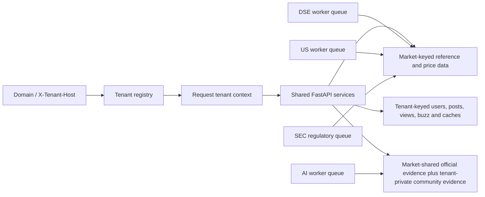

# Multi-Tenant and US Readiness

## Decision record

The platform is a shared application and shared database with tenant-scoped product data. A tenant
selects branding, locale, domain, market, and enabled capabilities. Market data remains keyed by
`market`; social, identity, derived attention, caches, and tenant-authored RAG evidence are keyed by
`tenant_id` as well.

Accounts are tenant-local. The same email may register independently on two products, but email,
phone, and handle are unique inside one tenant. Cross-product SSO is not implied. If SSO becomes a
product requirement, introduce a global identity plus tenant memberships as a separate migration;
do not overload the current `users` rows.



## Enforced invariants

- Every public ticker page must be active, not hidden, and either `ready` or `research_only`.
  Only `ready` symbols participate in market aggregates, Ideas, screeners, and signal agents.
  `research_only` is a visible high-risk due-diligence tier with its failed gates disclosed.
- US security-master records start as `reference_only`; a selected cohort moves to `onboarding`.
  A versioned cohort run sets `ready` only after every instrument-aware identity, price, SEC, and
  analytics gate passes. An owner-acknowledged `--publish-research` run may set
  `research_only` when only marketability gates fail; identity, history, freshness, integrity, and
  regulatory-evidence failures stay private. A bounded daily job refreshes research-only data
  without sending those symbols into recommendation surfaces.
- Access and purpose tokens require issuer, audience, tenant, issued-at, and expiry claims. Access
  tokens carry `auth_version`; reset/verification links are bound to the current email, and reset
  tokens are one-time through `auth_version`. Refresh rotation locks its row before replacement.
- Community queries, page views, buzz snapshots, RAG retrieval, Redis screen/watch caches, and
  moderation are tenant-scoped.
- Official exchange evidence may be shared inside one market; community RAG chunks may not cross a
  tenant boundary.
- AI, DSE ingestion, US EOD ingestion, and SEC regulatory ingestion use separate arq queues.
- Market capabilities are explicit. A tenant does not render DSE-only screens merely because a
  route exists in the shared bundle. API endpoints enforce the same capability contract, and
  tenant sitemaps advertise only enabled public route families.
- `/live` measures process liveness. `/ready` checks Postgres and Redis. Requests carry an
  `X-Request-ID` and emit a latency record.

## US onboarding flow

1. For a broad company expansion, generate deterministic private cohorts using
   `ingestion.universe_discovery`; see
   [`us-small-mid-cap-onboarding.md`](./us-small-mid-cap-onboarding.md). Review the full exclusion
   report and selection snapshot before staging anything.
2. Create or review a versioned cohort manifest. The canonical manifest hash, policy, requested
   symbols, evidence, and decisions are retained in `universe_onboarding_runs` and
   `universe_onboarding_results`.
3. Stage the cohort. This refreshes Nasdaq Trader/SEC identity, performs the requested history
   backfill, collects targeted EDGAR data, computes analytics, and evaluates all readiness gates:

   ```bash
   uv run python -m ingestion.universe_onboarding \
     tenants/bullsofwallst/cohorts/liquid-expansion-v1.json
   ```

   A staged run never makes symbols public. If interrupted, resume the same auditable run with
   `--resume <run-uuid>` and the exact same manifest.
4. Review every failed gate, including stable identity, product eligibility, instrument type,
   exchange, price depth/span/freshness/quality, required CIK/EDGAR evidence, and analytics.
   Institutional 13F mapping is recorded as evidence but is non-blocking unless the manifest policy
   explicitly makes it required.
5. Promotion is a separate, fail-closed operation. Record the approved redistribution authority in
   `US_MARKET_DATA_AUTHORIZATION_ID`, deliberately enable `US_UNIVERSE_PROMOTION_ENABLED`, then run
   the cohort with `--promote`. The authorization identifier is copied into the audit record.
   Never use these settings to represent an unreviewed provider or terms-of-service assumption.
6. Perform API, UI, SEO, adjusted-price, split/dividend, and cross-source reconciliation samples.
7. Start `ingestion.us_worker.WorkerSettings`. Its EOD chain requires at least 90% same-session bar
   coverage before publishing analytics.
8. Advance to the next cohort. Keep the cohort size within provider rate limits and operational
   capacity.

Yahoo is a replaceable, no-key bootstrap adapter for internal evaluation, not the production US
redistribution contract. The provider interface allows a licensed feed to replace it without API
or UI changes. The application refuses cohort promotion until an operator records the external
authorization and explicitly opens the promotion gate.

## RAG design

SQL remains authoritative for price, volume, indicators, fundamentals, and ownership. pgvector is
used only to retrieve unstructured evidence. The default embedding path is local FastEmbed with a
768-dimensional multilingual model; it requires no Ollama, Claude, OpenAI, or per-request API fee.

Retrieval filters by market, current embedding model, code, and tenant policy. It rejects weak
semantic matches, returns at most one chunk per source, then reranks using source reliability and
recency. Answers must cite returned evidence and must not turn a crowd post into an official cause.
Chunk identity includes tenant, market, source, and embedding model, so a new model can be indexed
alongside the serving model. Complete and evaluate the new index before switching the API setting;
old-model rows can be pruned only after rollback is no longer required.

## External launch gates

These cannot be solved by application code and must stay closed until an owner records approval:

- A licensed US market-data contract covering storage, derived analytics, display, delay labels,
  and redistribution on the public domains.
- An official, annually refreshed exchange calendar. The current US worker intentionally refuses to
  run outside the verified 2026 calendar instead of guessing holidays or early closes.
- Production SEC filing/fundamental/13F coverage reconciliation before advertising those features
  as complete. Missing or unresolved issuer evidence must remain visibly unavailable, never guessed.
- US-specific quantitative validation for every public screen, threshold, claim, and explanatory
  sentence. DSE backtests and Taka liquidity cutoffs are not transferable evidence.
- Legal review for publisher versus adviser positioning, disclaimers, market-data attribution,
  privacy/cookies, community moderation, and alert language in each served jurisdiction.
- Sender-domain verification for each tenant email address, plus SPF, DKIM, DMARC, bounce handling,
  and complaint suppression.
- A same-site API hostname per public tenant (for example `api.bullsofwallst.com`). Production
  refresh tokens are `Secure`, `HttpOnly`, `SameSite=Lax` host cookies and must not depend on a
  third-party shared API origin that browsers may block.
- Backups with a tested restore procedure, secret rotation, vulnerability response ownership,
  uptime/error alerting, and a rollback runbook.
- Organization SSO/MFA for the admin portal with named roles and audit identity. The current shared
  admin token is session-scoped and fail-closed, but it is a bootstrap control, not a multi-operator
  identity system.

## Deployment checks

1. Apply migrations and run `alembic check`.
2. Confirm `/live`, `/ready`, and `/whoami` through each domain and the shared API path.
3. Confirm unknown hosts cannot reach tenant-sensitive routes before enabling strict host rejection
   at the edge/API. CloudFront must forward `X-Tenant-Host` for shared origins.
4. Rebuild the web artifact for each domain and verify canonical/OG/SEO output.

   ```bash
   ./deploy-prod.sh
   WALLST_S3_BUCKET=... WALLST_CLOUDFRONT_ID=... ./deploy-wallst.sh
   ```
5. Re-embed knowledge chunks after an embedding-model change.

   ```bash
   uv run python -m bulls.ai.reindex --market DSE --tenant bullsofdhaka
   ```
6. Compare source and database counts for the latest session before enabling the US worker.
