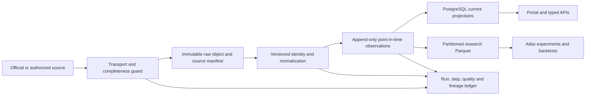
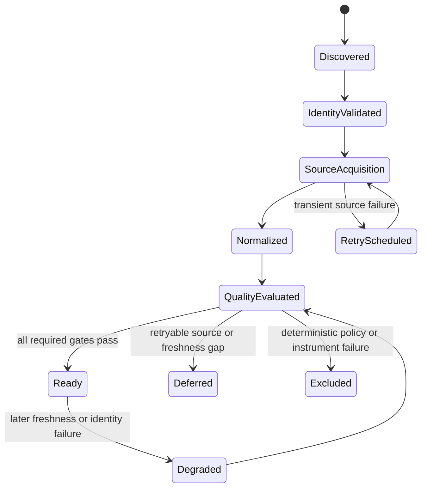

# Bulls Research Data Foundation

Status: production migration and forward-lineage activation complete; DSE and initially hydrated US
bar baselines accepted; complete US private-research catalog rollout in progress, July 17, 2026.

This document governs data onboarding for Bulls of Dhaka, Bulls of Wall Street, and Bulls Atlas.
It distinguishes an operational market-data product from a point-in-time research platform. A
dataset can be correct for today's portal and still be unsafe for a historical experiment.

## Executive decision

Keep the current lightweight stack:

- PostgreSQL for identities, normalized operational facts, current projections, control-plane
  state, permissions, and audit records;
- S3-compatible immutable object storage for allowed raw deliveries and normalized artifacts;
- Parquet with Polars/DuckDB for cross-sectional research and reproducible backtests;
- Redis/arq plus systemd for bounded execution, with PostgreSQL as the durable ledger;
- pgvector for evidence retrieval only, never for exact facts or numerical calculations.

Do not add Kafka, Airflow, Spark, or an Iceberg catalog now. They do not repair missing timestamps,
source revisions, or security identity history. Consider Iceberg only after immutable Parquet data
is large enough to require concurrent writers, table-level time travel, or frequent partition and
schema evolution. Apache Iceberg is designed for huge analytical tables; Bulls is not at that scale
yet.

The control-plane schema follows the OpenLineage run/job/dataset model and its input/output quality
facets, but Bulls does not need to operate an OpenLineage backend yet. Emitting compatible events can
be added later without replacing the PostgreSQL ledger.

## Non-negotiable research contract

Every researchable observation must identify:

- `tenant_id` and `market` where the evidence is brand-scoped;
- stable `security_id`, plus the listing identifier used by the source at that time;
- `effective_at`: the period or event represented;
- `published_at`: the source publication timestamp when available;
- `known_at`: the earliest instant the platform or a normal market participant could know it;
- `ingested_at`: when Bulls received it;
- source record ID, revision, URL, schema version, normalization version, and content hash;
- unit, currency, corporate-action basis, and quality verdict;
- the ingestion run and code version that produced it.

Historical queries use `known_at <= decision_time`. A current projection is never silently treated
as historical evidence. Missing publication time, inactive-security history, or source revision is
an explicit absence state that can fail a validation gate.

## Current maturity matrix

| Dataset | Operational serving | Research-safe today | Main gap |
|---|---|---|---|
| US options sentiment | Yes, owner-only | Yes for accepted snapshots | Expand only after licensing and Phase A evaluation |
| SEC filing metadata | Yes | Mostly | Raw source hash/snapshot and complete historical submissions |
| SEC Company Facts | Yes | Forward-safe after migration | Accession revisions are appended; pre-migration refresh is required |
| US 13F positions | Yes | Partly | Retained history is bounded; raw archive/hash lineage is incomplete |
| FINRA short volume | Yes | Partly | 120-day retention and no immutable raw file/hash manifest |
| US/DSE daily bars | Yes | Forward-safe after migration | Legacy rows require bounded bootstrap and remain `legacy_unknown` |
| US security master | Yes | Forward-safe after first refresh | Listing events begin at the first guarded post-migration snapshot |
| DSE company fundamentals | Yes | Forward-safe after first refresh | Source publication time is unavailable, so ingestion time is the conservative upper bound |
| DSE shareholding | Yes | Forward-safe after first refresh | Historical public release times are not invented |
| Ticker analytics | Yes | Reproducible current snapshot | Methodology/input hashes are stored; historical PIT completeness remains false until proven |
| Atlas research runs | Yes | Forward-safe for current runs | Immutable fact packs and claim citations are live; historical validation remains diagnostic |

The US options module is the reference implementation: entitlement gate, bounded input, immutable
content-addressed raw object, normalized Parquet, hashes, schema and identity versions,
`effective_at`/`known_at`/`ingested_at`, quality report, canonical-revision selection, and a
reproducible evaluation artifact.

## Desired data layers



### Immutable source layer

For sources whose terms permit retention, store bytes once using a content-addressed key and
server-side encryption. Record the source URL, HTTP validators, response time, byte count, SHA-256,
media type, and entitlement or usage decision. A repeated revision with the same provider revision
but different bytes is an incident.

Where raw retention is not permitted, retain a legally allowed manifest with source revision,
hash when allowed, row count, aggregate checks, schema version, and the explicit retention rule.

### Normalized observation layer

Append observations; do not update away history. Build current portal tables as replaceable
projections over the latest accepted observation. At minimum:

- `security` represents the economic security;
- `listing` represents one venue listing with valid-from/valid-to;
- `security_identifier_history` maps ticker, CIK, CUSIP, and source aliases over validity time;
- `daily_bar_observation` preserves provider corrections and corporate-action basis;
- `financial_fact_observation` preserves every filing/accession revision;
- DSE fundamental and ownership observations preserve disclosure date and first-known time.

### Research layer

Write accepted observations to Parquet partitioned by dataset, market, and effective date. Include
`security_id`, known time, revision, and source snapshot ID in every row. DuckDB/Polars queries must
receive an explicit snapshot/input fingerprint. PostgreSQL remains the serving store; historical
experiments must not scan mutable current tables by default.

## Onboarding state machine

The present US flow has strong manifest hashing, deterministic gates, private staging, idempotent
upserts, bounded cohorts, and explicit publication. It needs stage-level durability and outcome
classification:



Each stage records start/end, attempt, input/output fingerprints, row/byte counts, quality checks,
and a bounded error. Resume starts at the first incomplete stage. A cohort is backlog-complete only
when every member is `ready`, `deferred` with a next retry, or `excluded` with a durable reason.
"Pipeline completed with failed symbols" is not a terminal disposition.

The following failure groups must remain distinct:

- **source/transient**: timeout, rate limit, unpublished session, incomplete download;
- **data gap/retryable**: missing bars, stale source, missing SEC facts, analytics not built;
- **identity/manual policy**: ambiguous share class, ticker reuse, unsupported instrument;
- **marketability/dynamic**: price, liquidity, capitalization, listing status;
- **quality/incident**: impossible values, duplicate identity, source count collapse, hash collision.

No human reviewer is required in the normal path. The system makes deterministic dispositions,
surfaces exceptions, and requires an owner decision only for policy or licensing changes.

## Market and tenant isolation

DSE and US public/reference datasets may share one PostgreSQL instance. Their composite market keys
are the correct boundary and avoid duplicating infrastructure. Customer-private data remains
tenant/market/user scoped with forced PostgreSQL RLS and composite foreign keys.

Required invariants:

- every reference-data primary/unique key includes `market` unless the identifier is globally
  authoritative;
- every brand-specific artifact includes both `tenant_id` and `market`;
- API sessions derive market from the resolved host tenant, never from an untrusted request field;
- research RLS context is transaction-local and cannot survive connection pooling;
- no cross-market claim, citation, run, workspace, portfolio, or evidence foreign key is possible.

Private research readiness is separate from public symbol publication. `symbols.data_status`
continues to gate the public portals and licensed redistribution; `symbols.research_status` records
whether authenticated Atlas has complete, partial, degraded, or unavailable evidence. A private
backfill can therefore make a symbol researchable without silently publishing its vendor-derived
prices. Atlas accepts `ready` and explicitly `partial` evidence; unresolved and unavailable symbols
do not enter the research queue.

## Acceptance and service levels

Run the unified read-only report after migrations, cohort runs, provider changes, and before a
research release:

```bash
uv run python -m ingestion.foundation_audit --strict
uv run python -m ingestion.foundation_audit --market US --strict
```

The report complements, not replaces, the DSE and US freshness watchdogs. Initial acceptance:

- security-master refresh refuses partial source files, duplicate symbols, a greater than 25%
  active-universe collapse, or low SEC identity coverage;
- latest ready-symbol EOD coverage is at least 90%, with the production EOD gate remaining stricter;
- analytics date exactly matches the latest accepted bar date;
- zero stable-identity drift and zero stale onboarding runs;
- every onboarding gate failure has a classified disposition and retry date or exclusion reason;
- source checkpoints expose records, symbols, bytes, source date, completion time, and quality;
- table growth, run duration, retry count, and source failure rate are reviewed per cohort.
- every active US product listing has a terminal private-research state (`ready`, `partial`, or
  `unavailable`); `reference_only`, `onboarding`, or `degraded` in that active product scope means
  the catalog is incomplete and strict acceptance fails. Inactive or product-excluded historical
  symbol rows remain queryable for identity continuity but do not block acceptance.

## Implemented foundation

Migration `f6d8a0c2e4b7` adds:

- immutable source snapshot manifests with normalization and code versions;
- append-only bar corrections, listing events, SEC accession-level facts, and DSE company records;
- database triggers that reject update/delete on foundation artifacts;
- resumable onboarding stages with attempts, bounded errors, and input/output fingerprints;
- analytics methodology/input fingerprints and an explicit point-in-time completeness flag;
- an Atlas validation gate that remains diagnostic while revision or inactive-universe history is
  incomplete.

Application release `dbd30da` activates the previously dormant Atlas evidence schema. Each new
company-research run persists the complete registered fact pack as immutable evidence documents and
fact spans, links the selected documents to the run, and requires every generated claim to cite its
registered spans. Missing lineage fails the transaction. Production smoke runs on July 17 verified
this path independently for `bullsofdhaka/DSE/BSC` and `bullsofwallst/US/NXTC` through forced RLS;
the cross-tenant lineage mismatch count was zero. Older successful runs without a `lineage` summary
remain identifiable legacy records and are not assigned fabricated citations.

The migration is intentionally schema-only. It does not bulk-copy a large production table while
the constrained server is serving traffic.

## Production activation order

1. Recover host capacity and take a database snapshot.
2. Deploy code and run `alembic upgrade head`.
3. Run `foundation_audit --strict`; initial ledger-coverage failures are expected and measurable.
4. Bootstrap bars in bounded slices using `foundation_bootstrap <market> --limit 25`, resuming with
   the returned `next_after`. Existing history is marked `legacy_unknown`, never backdated.
5. Refresh the US security master, US SEC data, and DSE company data once to establish their
   immutable baselines.
6. Recompute DSE and US analytics so every current row receives a methodology/input fingerprint.
7. Run the strict audit again. Do not enable Atlas validation until critical lineage findings are
   zero.

## Production activation record: July 17, 2026

- The upgraded host has 4 vCPU, 16 GiB RAM, and sufficient disk headroom. DSE and US APIs, market
  workers, SEC worker, research worker, AI worker, and Atlas lifecycle worker are active.
- The DSE weekly company sweep previously hit ARQ's 300-second default at 296 symbols. The cron now
  has a tested 30-minute bound; the recovery completed 395 source-available profiles, 395 distinct
  immutable company lineages, and 18 sector P/E rows. The one absent profile remains an explicit
  source gap.
- A guarded US security-master refresh accepted 13,057 current listing additions and two removals,
  producing 13,059 immutable listing events after universe-size, duplicate, source-file, CIK, and
  identity-continuity checks passed.
- DSE analytics were recomputed for 396/396 ready symbols and US analytics for 367/367; every row
  now carries the current methodology version and input fingerprint.
- Ten still-forming July 17 US daily candles were removed from mutable bars, analytics, and pattern
  projections. Restricted research was rebuilt for all ten names through the latest completed
  session. Their source observations remain auditable and cannot enter a completed-session query.
- The SEC baseline completed 372/372 applicable current research issuers: 368 fact-bearing manifests
  plus four accepted zero-fact manifests, with no failed or unversioned delivery. DSE bar lineage
  covers all 192,776 current projection rows across 401 symbols. The initially hydrated US universe
  has 1,287,536 immutable observations across 612 symbols; ten extra observations preserve rejected
  still-forming revisions and are intentionally absent from the 1,287,526-row current projection.
- The guarded US master contains 11,071 active product listings: 5,216 common stocks, 306 ADRs, and
  5,549 ETFs. A deterministic 100-symbol private catalog now advances through the same durable
  history, SEC-applicability, analytics, and gate ledger. Public status is unchanged by this job.

## Longer-term migration order

1. **Disposition lifecycle**: add deferred/excluded symbol states and explicit next-retry scheduling.
2. **Economic-security identity**: model issuer/security/listing separately for rename, venue
   transfer, and multi-class history; current listing events prevent silent CIK reuse meanwhile.
3. **Research Parquet**: export accepted observations to partitioned Parquet while retaining
   `daily_bars` and other current projections for portal reads.
4. **Backtest adapter**: switch Atlas universe and factor selection to known-time observations.
   Until then,
   survivorship, identity-history, and known-time gates must remain failed and results unvalidated.
5. **Source archives**: retain raw SEC, 13F, FINRA, DSE, and price deliveries where terms permit;
   attach exact input fingerprints to analytics and research runs.
6. **Scale only from measurements**: introduce an Iceberg catalog or heavier orchestrator only when
   object count, query latency, concurrent writers, or recovery time exceeds defined limits.

## Primary references

- [OpenLineage object model](https://openlineage.io/docs/spec/object-model/)
- [OpenLineage dataset facets](https://openlineage.io/docs/spec/facets/dataset-facets/)
- [DuckDB Parquet scanning and pushdown](https://duckdb.org/docs/stable/data/parquet/overview)
- [Apache Iceberg time travel and schema evolution](https://iceberg.apache.org/docs/latest/)
- [Apache Iceberg hidden partitioning](https://iceberg.apache.org/docs/latest/partitioning/)

## Remaining limitations

- A failed cohort member still needs a durable deferred/excluded disposition and next-retry time;
  stage checkpoints prevent completed acquisition work from repeating.
- Security listing events and CIK continuity checks are implemented, but the full economic
  security/listing/identifier split remains future work.
- SEC accession revisions are retained after activation; raw EDGAR JSON is not yet archived.
- Existing bars can be baselined but cannot acquire publication timestamps the source never
  provided. Their `legacy_unknown` label is permanent and intentional.
- Atlas backtest universe selection uses current active symbols, current cap tier, and current
  liquidity ranking. The engine correctly labels point-in-time universe completeness false, but
  those metrics are not institutional validation evidence.
- The shared host also runs a separate trading stack. Long baselines therefore run as bounded,
  low-priority transient systemd units and are sequenced rather than launched concurrently. API
  latency and load are checked between stages; a transport disconnect must not cancel a data job.
