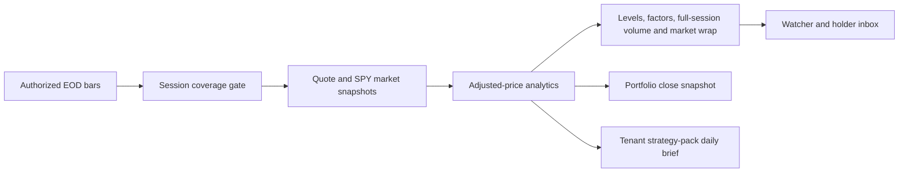

# US EOD Research Workflow

## Product contract

Bulls of Wall Street is an end-of-day research product until an authorized intraday provider is
configured. It never describes an EOD snapshot as live. Shared API and UI code resolve a registered
market strategy pack; DSE research thresholds and backtest claims are not reused for US equities.

The `us-eod-research-v1` pack has three queues:

- **Today:** SPY-relative strength, full-session relative volume, and recent official SEC filings.
- **Financials:** SEC-derived trailing free-cash-flow quality and explicit liquidity/leverage/cash-
  flow review flags. Financials and real estate are excluded from ordinary debt-ratio flags.
- **Funds:** aggregate Form 13F accumulation and distribution. Every explanation states the
  quarter-end and disclosure limitations.

SQL remains authoritative. Scanner prose is deterministic and cites the exact condition that put a
symbol in a queue. No model chooses securities or changes a metric.

## Daily sequence



The completion marker is written only after price snapshots, analytics, signals, alerts, portfolio
snapshots, and buzz snapshots finish. Retries are safe: signal occurrences, one-shot price alerts,
and external evidence source keys prevent duplicate delivery.

The first run is `22:45 UTC`, which is 1h45 after the regular close in standard time and 2h45 after
the close in daylight time. `23:30`, `01:30`, and `13:30 UTC` are idempotent recovery checks. A run
cannot publish until the configured ready-symbol coverage threshold is met.

FINRA Reg SHO is a separate ordered nightly chain at `23:45 UTC`: download, validate header/date/
record-count trailer, persist matched rows and a `regulatory_data_state` checkpoint, then evaluate
the short-sale-activity desk. A missing holiday file or transient failure produces no user content;
the five-session catch-up window retries it and the watchdog reports prolonged staleness privately.

## Alert semantics

- US price levels are evaluated after a completed session and are labelled **session close**, not
  intraday.
- Level and unusual-volume signals run only after the EOD coverage gate and analytics succeed.
- New material SEC filings fan out only to users watching or holding the security.
- New 13F quarter summaries fan out only to interested users and explicitly state that 13F omits
  trade dates, execution prices, shorts, and intent.
- The institutional desk runs after the weekly Sunday 13F refresh. It requires material aggregate
  share change plus manager-breadth confirmation and publishes at most ten names per new quarter.
- FINRA activity is available on every ready ticker page. The public desk publishes only the five
  largest statistically confirmed anomalies; it never calls daily short volume short interest or a
  bearish signal.
- External evidence alerts use a unique `(tenant, user, source_key)` index, so a worker retry cannot
  send the same disclosure twice.

## Cohort promotion

Staging fetches and validates evidence but never publishes symbols. The current 42-symbol expansion
cohort passed all required gates and remains staged because production has no recorded market-data
redistribution authorization. Once the owner records an approved contract:

```bash
US_MARKET_DATA_AUTHORIZATION_ID=<approved-contract-id>
US_UNIVERSE_PROMOTION_ENABLED=true
uv run python -m ingestion.universe_onboarding \
  tenants/bullsofwallst/cohorts/liquid-expansion-v1.json \
  --evaluate-only --promote
```

`--evaluate-only` does not repeat provider fetches or the ten-year backfill. It rechecks the current
persisted evidence and creates a separate immutable promotion audit record. The gate must not be
bypassed for an unreviewed free bootstrap source.

## Product measurement

Consent-gated first-party analytics receive non-sensitive funnel events only: page view, search
selection, idea open, watchlist change, research question, price-alert change, and alert open.
For EEA/UK visitors, Google Analytics and first-party product analytics remain denied until consent;
the saved choice is reapplied on every load. Events carry market, board,
event kind, or ticker where relevant. They never carry email, phone, portfolio quantity, cost basis,
alert price, or free-form community content.

Review weekly:

1. Search selection to stock research.
2. Stock research to watchlist addition.
3. Watchlist to price-alert creation.
4. Alert open rate by filing, ownership, level, and volume kind.
5. Ideas board opens and downstream research usage.
6. Seven-day returning users with a watchlist or portfolio.
