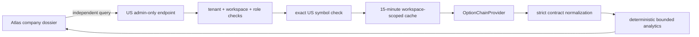

# US Options Owner Preview

Status: implemented as an experimental, platform-admin-only Atlas read. It is not a public portal
feature, a trading signal, a historical options dataset, or a licensed redistribution product.

## Purpose

Give the owner a narrow way to inspect one listed US option chain while licensing is unresolved.
The first screen answers four bounded questions:

1. Does this ticker have a sufficiently quoted chain?
2. What are expiry-specific put/call volume and open-interest ratios?
3. What are the observed near-the-money IV, approximate skew, and straddle-implied move?
4. Which measures are missing because the source did not provide usable quotes?

No measure is translated into a bullish/bearish instruction. Option volume and open interest do not
identify buyer/seller initiation or opening/closing activity.

## Request Path

- Endpoint: `GET /institutional-research/workspaces/{workspace_id}/companies/{code}/options-chain`
- Optional query: `expiration=YYYY-MM-DD`
- DSE requests return `404` before any provider call.
- US non-admin users return `403`.
- The symbol must be active, visible, and `ready` or `research_only` in the US universe.
- Cache identity includes tenant, workspace, market, ticker, and expiry.
- A provider failure cannot fail or delay the core company dossier because the UI loads it
  independently.

## Provider Policy

The current adapter uses Yahoo's unofficial chain endpoint with its cookie/crumb handshake. Every
response is labelled delayed, experimental, and unlicensed. The initial request selects the nearest
expiry at least seven calendar days away so a same-day series with empty pre-market quotes does not
become the default; the owner may still select another listed expiry.

This source is permitted only for the narrow owner preview. It must not be used for:

- public redistribution;
- bulk universe collection;
- scheduled historical backfill;
- institutional customer delivery;
- paper-trading or backtest claims.

Cboe's public delayed-quote JSON is technically accessible and richer, but Cboe's delayed-quotes
page explicitly prohibits automated extraction. It is therefore not integrated. A commercial or
public options product requires a licensed source and a documented display/redistribution
entitlement.

## Analytics Contract

Analytics operate on the complete returned expiry while the UI is bounded to the 40 strikes nearest
spot per side.

- `usable`: enough two-sided contracts pass the activity and spread checks.
- `thin`: some usable contracts exist, but coverage is insufficient.
- `no_liquid_options`: no contract passes; this is an explicit absence state.
- Put/call ratios are reported separately for volume and open interest.
- ATM IV is the median observed IV within 5% of spot, excluding unquoted contracts.
- Approximate downside skew is 90-98% strike put IV minus 102-110% strike call IV.
- Approximate implied move is the nearest same-strike call plus put midpoint divided by spot.
- Missing values remain missing. Greeks are not fabricated.

## Historical Evaluation

No raw or derived chain is persisted in this phase. Saving owner-opened tickers would create a
selection-biased history and a GET request must not mutate the research ledger. After a licensed
source is approved, add a scheduled worker that captures a declared universe at a fixed market time,
stores derived metrics plus source timestamps and hashes, and evaluates only forward observations.
Do not backfill a strategy test from point-in-time data that was not actually available then.

## Claude Boundary

Claude is not an option-data source and does not already possess a current, licensed chain. A future
worker may send a compact normalized evidence object to the existing provider-neutral AI client so
Claude can challenge the deterministic interpretation. That reviewer must:

- run asynchronously after deterministic measurements exist;
- receive no personal credentials or raw unrestricted dataset;
- cite only supplied evidence and preserve missing values;
- never block the API or replace the deterministic record;
- remain disabled when API entitlement or budget is unavailable.

A paid Claude web/desktop subscription is separate from normal Anthropic API billing. Personal
Claude credentials must not be copied to the production server.
