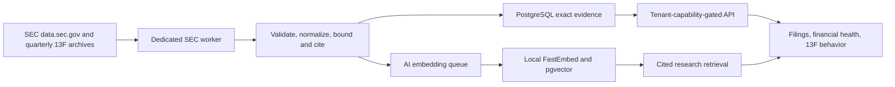

# US Regulatory Intelligence

## Product contract

This subsystem turns official SEC evidence into retail-readable facts. It is not a trade-copying
system. SQL is authoritative for filings, financial facts, and holdings; pgvector retrieves the
relevant unstructured evidence for research answers but never replaces exact database queries.

Form 13F reports long positions at quarter-end and may arrive up to 45 days later. It does not show
the actual purchase date, sale date, execution price, short book, or the manager's motive. Product
returns therefore start at the first complete public-disclosure date, never at quarter-end as if the
user could have known the data then.

## Ingestion boundaries

- `ingestion.sec_worker.WorkerSettings` owns the `arq:ingestion:sec` queue. It cannot block DSE or
  US EOD collection. Concurrency is one because EDGAR completeness matters more than throughput.
- Every request sends a descriptive User-Agent and monitored `SEC_CONTACT_EMAIL`. The Company Facts
  client stays below five requests per second and retries only rate-limit/server failures.
- SEC submissions are mandatory. Company Facts may legitimately be absent, especially for funds;
  that absence does not discard valid filing metadata.
- Raw submissions JSON and 13F ZIP files are transport data. They are parsed in memory or temporary
  storage and deleted. The database stores only normalized, cited product evidence.
- Shared issuers and multiple share classes retain one filing projection per ticker. Per-share
  calculations are suppressed for ADRs and shared-CIK securities unless a trustworthy conversion
  can be established.
- A 13F CUSIP is accepted only through an existing verified mapping, exact normalized issuer match,
  or an exact order-independent token signature after conservative legal/instrument normalization.
  Share classes must still resolve uniquely. Ambiguous and unresolved CUSIPs are counted and
  excluded, not guessed; fuzzy edit-distance matching is not used.
- An apparent 13F exit is recorded only when the manager filed a comparable current-quarter 13F.
  A missing manager filing is not treated as a sale.

## Financial normalization

The Company Facts whitelist covers revenue, profit, EPS, balance-sheet liquidity and leverage,
cash flow, capital expenditure, dividends, repurchases, and shares. Amendments supersede earlier
values for the same normalized period. Standalone Q2/Q3 cash-flow values are derived only by
subtracting adjacent year-to-date observations; missing periods stop the derivation. EPS is never
derived by subtracting cumulative values because weighted-average share counts make that invalid.

TTM calculations prefer four consecutive standalone quarters. When those are unavailable they use
the latest annual observation plus newer quarters minus matching prior-year quarters. The UI links
back to the relevant SEC filing and labels unavailable evidence instead of fabricating a value.

## Bounded storage

| Data | Retention | Bound |
| --- | --- | --- |
| Filing metadata | 7 years | Selected forms only; no filing body mirror |
| Company Facts | 8 years | Up to 24 periods per whitelisted metric and ticker |
| 13F summaries | 8 quarters | One aggregate row per ticker and report date |
| 13F positions | 8 quarters | At most 150 high-value/high-change managers per ticker/quarter |
| Raw SEC payloads | None | Temporary only |
| RAG chunks | Current source projection | Stale filing, fact, and 13F chunks are pruned |

At `N` ready US tickers, the hard 13F position ceiling is `N x 8 x 150` rows. Actual rows are lower
because only confidently mapped positions in the top-value/top-change set survive. Before expanding
a cohort, record table row counts, total relation size, unmatched-CUSIP rate, symbols covered, and
refresh duration. Partitioning is unnecessary at launch; consider report-date partitioning only
after measured table/index growth justifies the operational complexity.

## Production acceptance

1. Back up PostgreSQL and apply the single Alembic head.
2. Run a small reconciliation cohort such as `AAPL, MSFT, GOOGL, GOOG, SPY, BABA` before the full
   ready universe. Confirm shared-CIK filings survive for both Alphabet tickers, ETF filings survive
   without Company Facts, and ADR per-share values are suppressed.
3. Backfill the bounded history with
   `python -m ingestion.sec_13f --history-quarters 8 --force`. The importer commits one comparable
   period at a time, removes each archive immediately after parsing, and can be rerun safely after
   interruption. Sample new, increased, reduced, exited, and unresolved positions against linked
   SEC filings.
4. Compare `regulatory_data_state` coverage/failure counts and inspect PostgreSQL relation sizes.
5. Reindex US SEC evidence with local FastEmbed, then verify exact SQL facts and cited RAG answers
   agree for the same ticker and period.
6. Verify Bulls of Wall St pages and API responses in both languages. Recheck Bulls of Dhaka to
   prove DSE behavior and capabilities are unchanged.

The institutional API reports ownership only at quarter-end snapshots. Manager breadth and
multi-quarter direction come from those snapshots. Thirty/sixty-session returns and SPY-relative
returns start only after the aggregate period's latest filing was public. Manager histories remain
CIK-specific and bounded to retained material rows; similarly named managers are never merged.
