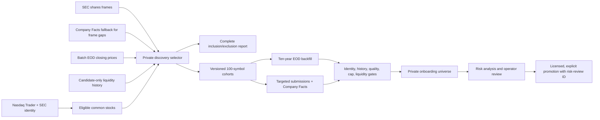

# US nano-to-mid-cap universe onboarding

## Objective

Build a researchable US-listed company universe without treating every exchange symbol as an
investable company or making a discovery estimate public. The initial scope is domestic common
stock. ADRs require a separate depositary-ratio-aware market-cap policy. Nano and micro caps are
kept in an enhanced-risk research tier rather than presented as ordinary small caps.

## Universe contract

| Band | Discovery market cap | Initial treatment |
|---|---:|---|
| Below research floor | below $1M | excluded; shell and data-error risk dominates |
| Ultra nano cap | $1M to below $10M | private enhanced-risk quarantine |
| Nano cap | $10M to below $50M | private enhanced-risk cohort |
| Micro cap | $50M to below $300M | private enhanced-risk cohort |
| Small cap | $300M to below $2B | onboard after mid caps |
| Mid cap | $2B to $10B | onboard first |
| Large cap | above $10B | outside this expansion |

Every selected name must also have:

- active, product-eligible common-stock identity from Nasdaq Trader;
- a CIK and recent SEC shares-outstanding frame or Company Facts observation;
- closing price at least $0.10;
- at least 40 valid sessions in the three-month discovery window;
- at least $2M median 20-session dollar volume for small/mid caps, $250K for micro caps,
  $100K for nano caps or $50K for ultra nano caps, plus 95% non-zero-volume sessions;
- price no more than 10 calendar days old and shares evidence no more than 460 days old;
- no obvious blank-check/SPAC issuer name.

This phase covers exchange-listed securities in the existing Nasdaq/NYSE-oriented security master.
OTC Markets securities are not silently mixed into it: OTC identity, quotation entitlements,
delinquency status and disclosure tiers require a separate source contract and policy.

`Penny stock` is not used as a market-cap band. A separate `penny_price` risk flag applies below $5,
and `sub_dollar` applies below $1. This prevents a $4 stock with a large share count from being
mistaken for a microcap and ensures a $20 nano cap is not treated as low risk.

The broad market-cap estimate is `latest EOD close x SEC frame shares outstanding`. It is only a
candidate-selection estimate. Multiple share classes, unusual capital structures and stale XBRL can
distort it. Full Company Facts and analytics recompute the value before the promotion gate.

## Data flow



The discovery adapter uses Yahoo only as a replaceable, no-key bootstrap input for private
evaluation. It is not redistribution authority. Public promotion remains disabled until an approved
market-data agreement is recorded.

## Commands

Generate a current report and manifests:

```bash
uv run python -m ingestion.universe_discovery
```

Test a bounded slice:

```bash
uv run python -m ingestion.universe_discovery \
  --limit-listings 200 \
  --output-dir var/us-universe/sample
```

Stage exactly one mid-cap cohort, the safe default:

```bash
uv run python -m ingestion.universe_onboarding_batch \
  var/us-universe/YYYY-MM-DD/manifest-index.json \
  --band mid_cap
```

Stage an enhanced-risk cohort only after the risk UI and operating review are ready:

```bash
uv run python -m ingestion.universe_onboarding_batch \
  var/us-universe/YYYY-MM-DD/manifest-index.json \
  --band micro_cap
```

Process a larger batch only after reviewing the previous cohort's duration, failures, downloaded
bytes and database growth:

```bash
uv run python -m ingestion.universe_onboarding_batch \
  var/us-universe/YYYY-MM-DD/manifest-index.json \
  --band mid_cap \
  --max-cohorts 3
```

`--all` is deliberately explicit. Promotion is not available in the batch command; each completed
cohort must be reviewed and promoted through the existing authorization-gated command. Ultra nano,
nano and micro manifests additionally require an auditable `risk_review_id` before promotion.

## Risk-removal sequence

Do not delete a company merely because it is volatile or unprofitable. Record named evidence and
separate hard exclusions from warnings.

Hard exclusion candidates:

- inactive, deficient, delinquent or bankrupt listing;
- missing or stale identity, price, filing or Company Facts evidence;
- price/liquidity below the published universe floor;
- unresolved shell/blank-check status;
- invalid price history or untrustworthy share-count/market-cap calculation.

Review/warning candidates:

- negative free cash flow, weak current ratio, high leverage or limited cash runway;
- repeated dilution, shelf registrations, at-the-market issuance or reverse splits;
- going-concern language, late filings, restatements, auditor changes or material weaknesses;
- extreme volatility, concentration, crowding or large gaps;
- recent IPOs with limited operating history.

The portal should explain each warning and cite the filing. A composite score may sort review work,
but it must never hide the underlying evidence or become an unsupported buy/sell label.

## On-demand preparation

US symbol search includes the active reference master. `ready` symbols open normally;
`research_only` symbols open with a high-risk warning and remain excluded from Ideas, rankings,
agents, and market aggregates. An authenticated request for any other eligible common stock creates
or reuses one market-level preparation job and records a separate tenant/user request for quota and
audit purposes.

The isolated `ingestion.research_worker.WorkerSettings` process handles one explicit job at a time:

1. validate immutable security identity and common-stock eligibility;
2. collect ten-year EOD history, targeted EDGAR submissions and Company Facts;
3. recompute analytics and deterministic quality gates;
4. automatically open as `ready` when all gates pass, open as `research_only` when only approved
   marketability gates fail, or remain unavailable on critical data and regulatory-evidence failure.

The API limits each user to five new tickers per UTC day by default. Repeated and concurrent requests
reuse the existing job. A rejected ticker waits 30 days before user-triggered reevaluation; failed
infrastructure work may retry immediately. There is no manual or invisible reviewer in this path;
the durable job result and deterministic gate evidence are the publication decision.

PostgreSQL is the durable job ledger; Redis is only the delivery mechanism. The research worker
reconciles queued rows every minute and recovers a `running` lease after the two-hour job timeout,
so an API/worker crash between commit and enqueue cannot strand a request permanently.

Form 13F is processed as a periodic full-reference-universe data set, never redownloaded per search.
Citadel Advisors LLC (CIK 1423053) and Tower Research Capital LLC (CIK 1533421) are retained even
outside ordinary rank cutoffs and labeled quantitative market makers. Their rows are historical
reported exposure, not evidence of trade timing or directional conviction.

## Capacity controls

- Closing-price discovery is batch-based: roughly 250 Yahoo requests for 5,000 listings.
- Per-symbol chart requests are limited to cap-qualified candidates and provide the liquidity gate.
- Six SEC frame requests replace thousands of Company Facts requests during broad discovery.
- A rate-limited Company Facts fallback resolves frame gaps; an explicit request ceiling fails closed
  if the workload unexpectedly expands.
- Full EDGAR collection runs only for selected cohorts and stays below SEC fair-access limits.
- Cohorts are capped at 100 by default and processed sequentially.
- Existing bounded retention remains: filings 7 years, facts 8 years/24 periods, 13F 8 quarters.
- Record table sizes, ingestion duration, failed symbols and unmatched 13F identifiers after each
  cohort. Do not add partitioning until measured growth justifies it.
